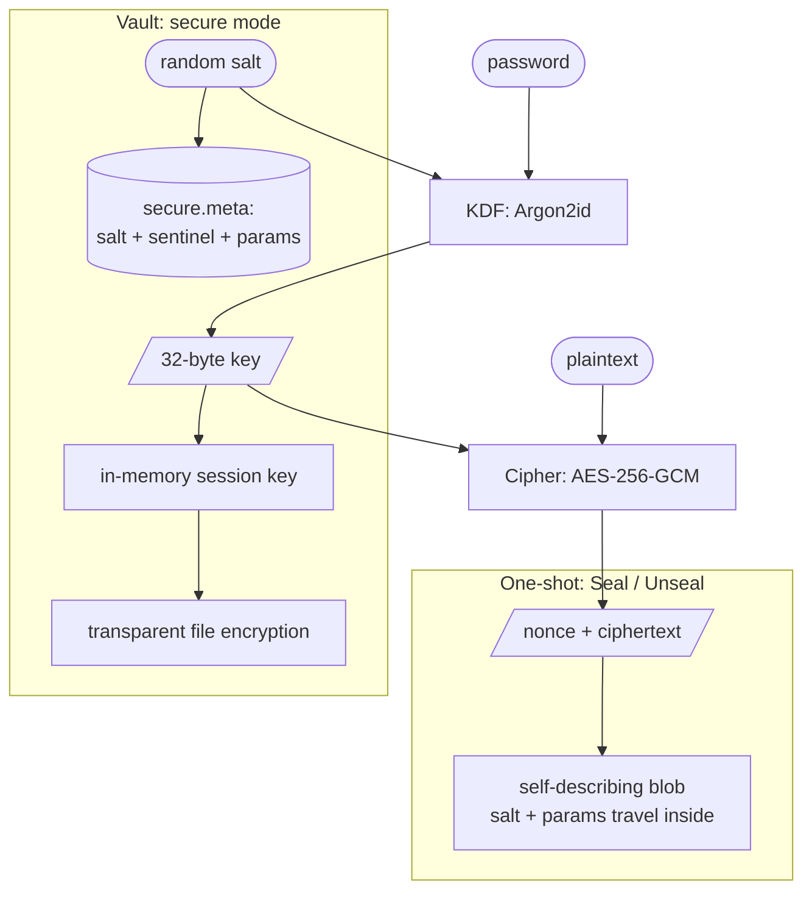

# go-secretbox

`go-secretbox` is a small Go library for encrypting data at rest with a
password. It is the boring, correct version of the code most projects write
exactly once and then quietly get subtly wrong: stretch a password with a slow
KDF, encrypt with an authenticated cipher, generate a fresh nonce, store a
salt, and verify the password later without ever storing it.

It was extracted from [matcha](https://github.com/floatpane/matcha)'s "secure
mode," where a single master password protects the mail client's config and
caches on disk.

## Two layers

- **`Seal` / `Unseal`** — one-shot. The salt and KDF parameters are embedded
  *inside* the returned blob, so it decrypts years later with only the
  password. Good for a single encrypted file, a token, a backup.
- **`Vault`** — the long-lived secure-mode pattern. A metadata file holds the
  salt and an encrypted *sentinel*; `Unlock` derives the key and verifies it
  against the sentinel, then keeps an in-memory **session key** for transparent
  file encryption until you `Lock`. Includes password change and key rotation.

Both layers share the same primitives and both let you swap them.

## Features

- **Sentinel password verification.** No password — and no hash of it — is
  ever stored. `Unlock` decrypts a known sentinel string and compares in
  constant time.
- **Pluggable KDF and cipher.** Argon2id + AES-256-GCM by default; swap in
  XChaCha20-Poly1305 or your own `KDF`/`Cipher`. The choice is recorded in
  metadata, so the right algorithm is always reconstructed on the way back.
- **Key hygiene.** Derived keys are zeroed after use and on `Lock`. `Rekey`
  decrypts everything *before* rotating, so a mid-operation failure can't
  strand your files.
- **Self-describing blobs.** A `Seal` blob carries a magic header, algorithm
  IDs, KDF parameters, and salt — no out-of-band schema to keep in sync.
- **Single dependency.** Only `golang.org/x/crypto`.

## What this is not

- **Not key management.** It protects data *with a password*. If the password
  leaks, so does the data.
- **Not memory-hardened against root.** While unlocked, the key is in process
  memory. `Lock` shortens that window; it does not defend against `ptrace` or
  a core dump.
- **Not a replacement for an OS keyring.** It's complementary — matcha uses the
  keyring when secure mode is off and a `Vault` when it's on.

## Sister projects

| Project | Role |
|---------|------|
| [floatpane/matcha](https://github.com/floatpane/matcha) | Reference consumer — config/cache secure mode. |
| [floatpane/go-uds-jsonrpc](https://github.com/floatpane/go-uds-jsonrpc) | Sibling extraction — local daemon JSON-RPC over Unix sockets. |

> [!NOTE]
> The import path is `github.com/floatpane/go-secretbox` and the package name
> is `secretbox`.
