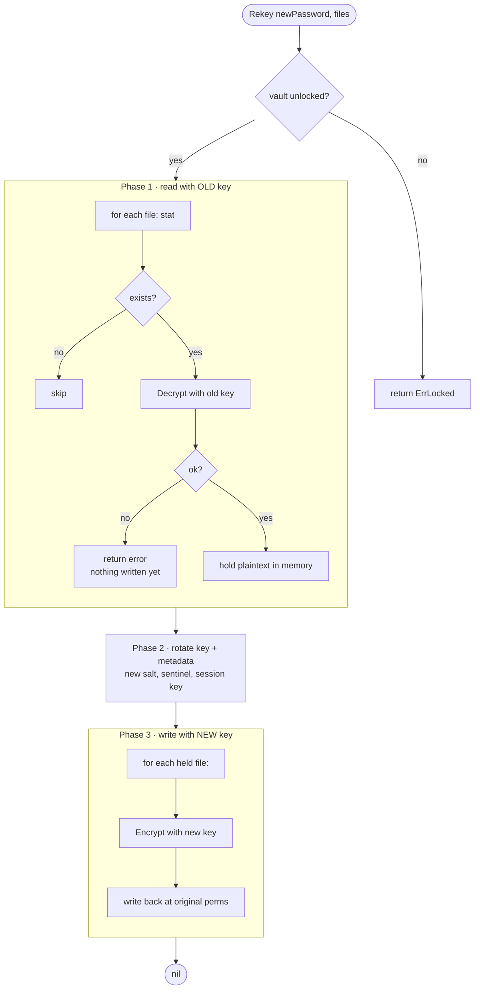

# Key Rotation

Rotating a master password means more than rewriting `secure.meta`: every file
encrypted under the old key must be re-encrypted under the new one. Do it in
the wrong order and a crash leaves files readable under *neither* password.

go-secretbox offers two entry points.

## ChangePassword — metadata only

`ChangePassword` re-keys the vault itself: new salt, new derived key, new
encrypted sentinel, rewritten metadata, swapped session key. It does **not**
touch any data files.

```go
if err := v.ChangePassword(newPassword); err != nil { … }
```

Use it only when no files are encrypted yet, or when you will re-encrypt them
yourself with the new session key.

## Rekey — migrate files atomically-in-effect

`Rekey` rotates the password *and* migrates a list of files, ordered so a
failure can never strand data.

```go
err := v.Rekey(newPassword, []string{
    "/home/me/.config/app/config.json",
    "/home/me/.config/app/cache.db",
})
```



The three phases matter:

1. **Read everything first.** If any file fails to decrypt with the current key
   — wrong assumption about which files belong to the vault — `Rekey` aborts
   *before* writing anything. No partial migration.
2. **Rotate once.** New salt and key are derived, the sentinel and metadata are
   rewritten, and the session key is swapped (old key zeroed).
3. **Write everything back** with the new key, preserving each file's original
   permissions.

> [!WARNING]
> `Rekey` is not transactional against power loss between phase 2 and the end of
> phase 3: metadata already points at the new password while some files may
> still hold old-key ciphertext on disk. Mitigate by keeping the plaintext set
> small, or snapshot the directory first. The common failure (wrong password,
> wrong file list, decrypt error) is caught safely in phase 1.

> [!NOTE]
> `Rekey` keeps the same KDF and cipher the vault currently uses. To migrate
> *algorithms* as well, decrypt with one vault and `Init` a new one with
> different `WithKDF` / `WithCipher` options.
