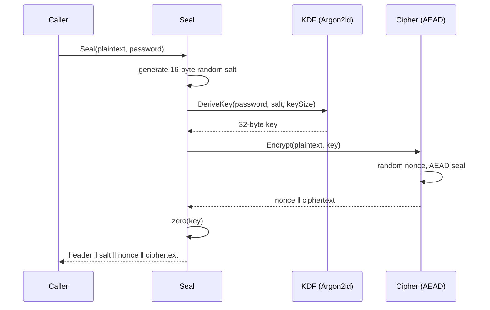
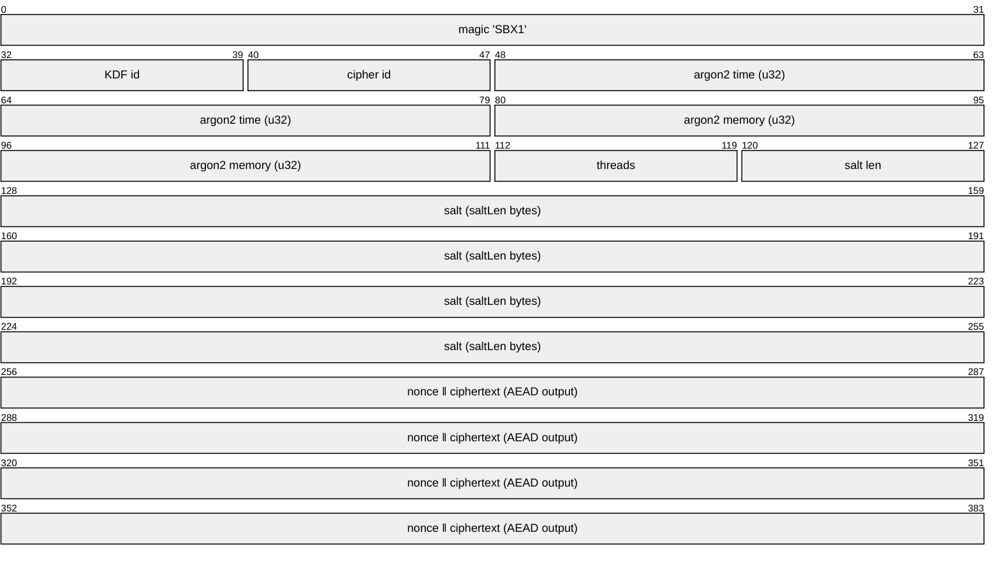

# One-Shot: Seal & Unseal

`Seal` and `Unseal` encrypt a single blob with a password. The defining trait
is that the output is **self-describing**: the salt and the KDF parameters
travel inside it, so `Unseal` reconstructs the exact key-derivation function
from the bytes alone.

```go
blob, err := secretbox.Seal(plaintext, password)
plain, err := secretbox.Unseal(blob, password)
```

Use `SealWith` to pick non-default primitives:

```go
blob, err := secretbox.SealWith(plaintext, password,
    secretbox.NewArgon2id(secretbox.Argon2idParams{Time: 4, Memory: 128 * 1024, Threads: 4}),
    secretbox.ChaCha20Poly1305{},
)
```

## What Seal does



`Unseal` reverses it: parse header → reconstruct KDF + cipher → derive key from
the embedded salt → AEAD open. A wrong password or any tampered byte fails the
authentication tag and returns `ErrDecrypt` — the two are indistinguishable on
purpose.

## Blob layout

Every `Seal` blob begins with a fixed 16-byte header, followed by the salt and
the cipher's nonce-prefixed output.



| Field | Bytes | Notes |
|-------|-------|-------|
| Magic | 4 | `"SBX1"` — version + format guard |
| KDF id | 1 | `1` = Argon2id |
| Cipher id | 1 | `1` = AES-256-GCM, `2` = XChaCha20-Poly1305 |
| Argon2 time | 4 | big-endian `uint32` |
| Argon2 memory | 4 | big-endian `uint32`, KiB |
| Threads | 1 | parallelism |
| Salt length | 1 | length of the following salt |
| Salt | _n_ | random per call |
| Body | rest | `nonce ‖ ciphertext`, framed by the cipher |

> [!TIP]
> Because parameters are embedded, you can raise `Argon2idParams` over time
> without a migration: old blobs still carry the old cost and `Unseal` honors
> it. New blobs get the new cost.

> [!CAUTION]
> A blob is only as secret as its password. `Seal` adds no per-user secret of
> its own — for shared secrets or rotation, use a [Vault](/vault).
