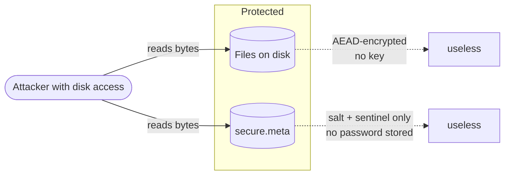
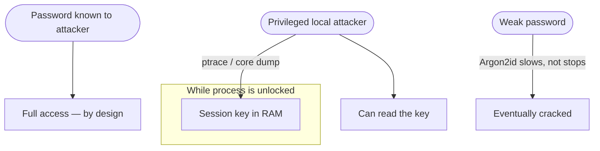

# Threat Model

go-secretbox protects **data at rest** with a **password**. Being explicit about
what that does and does not cover is part of using it correctly.

## What it defends against

- **Stolen disk / backup / repo.** Files are AEAD-encrypted; without the
  password they are noise. `secure.meta` exposes only a salt and an encrypted
  sentinel — neither reveals the password.
- **Tampering.** AES-GCM / ChaCha20-Poly1305 are authenticated. Any modified
  byte fails the tag and surfaces as `ErrDecrypt`.
- **Offline password guessing.** Argon2id makes each guess expensive in time
  and memory. Tune `Argon2idParams` to your threat model.
- **Oracle leakage.** `ErrDecrypt` does not distinguish "wrong password" from
  "corrupt data," and the sentinel comparison is constant-time.

## What it does NOT defend against

- **A known or weak password.** If the password leaks, so does the data.
  Argon2id slows brute force; it cannot rescue a guessable password.
- **A privileged local attacker.** While unlocked, the key lives in process
  memory. `ptrace`, a debugger, or a core dump can read it. `Lock` zeroes the
  key and shortens the window, but does not close it against root.
- **Key management.** There is no escrow, no recovery, no second factor. Lose
  the password, lose the data.
- **Side channels beyond the above.** No defense against cache-timing on the
  underlying AES if the platform lacks constant-time hardware (prefer
  `ChaCha20Poly1305` there).

## Defaults and tuning

| Knob | Default | When to raise |
|------|---------|---------------|
| Argon2id `Time` | 3 | Higher-value secrets, batch/offline contexts |
| Argon2id `Memory` | 64 MiB | Defend against GPU/ASIC cracking |
| Argon2id `Threads` | 4 | Match available cores |
| Cipher | AES-256-GCM | Use `ChaCha20Poly1305` without AES hardware |

> [!IMPORTANT]
> `DefaultArgon2id` targets *interactive login* — fast enough to not annoy a
> user unlocking on every launch. For secrets unlocked rarely or in the
> background, raise the cost.

## Reporting

Found a weakness? Please report privately — see
[SECURITY.md](https://github.com/floatpane/go-secretbox/blob/master/SECURITY.md).
Do not open a public issue for vulnerabilities.
