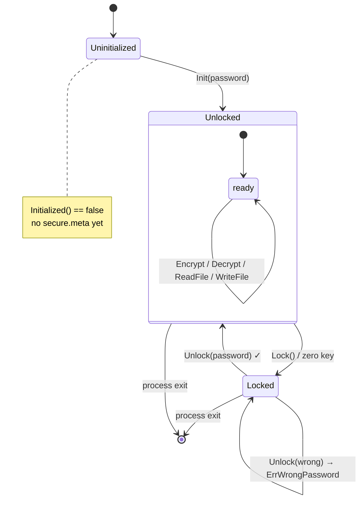
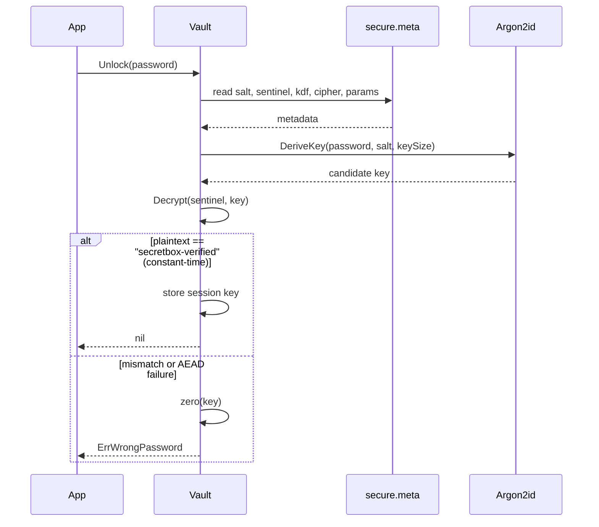

# The Vault

A `Vault` implements the "secure mode" pattern: enable it once with a master
password, and from then on the application's files are encrypted on disk and
transparently decrypted in memory while the vault is unlocked.

```go
v := secretbox.NewVault("/home/me/.config/app/secure.meta")
```

`NewVault` touches nothing on disk. It just binds a metadata path and the
default primitives (override with `WithKDF` / `WithCipher`).

## Lifecycle



- **`Init(password)`** — first run only. Generates a salt, derives the key,
  encrypts the sentinel, writes `secure.meta`, and leaves the vault **unlocked**.
- **`Unlock(password)`** — verifies against the sentinel and loads the session
  key. Reconstructs the KDF + cipher from metadata.
- **`Lock()`** — zeroes and drops the session key.
- **`Initialized()` / `Locked()`** — state checks.

## How Unlock verifies a password

No password is stored. `secure.meta` holds a salt and the *sentinel* — a known
constant string encrypted under the key. `Unlock` re-derives the key and tries
to decrypt the sentinel; a constant-time match proves the password.



## The metadata file

`secure.meta` is plain JSON — safe to store unencrypted. Its mere existence is
what `Initialized()` reports.

```json
{
  "version": 1,
  "kdf": "argon2id",
  "cipher": "aes-256-gcm",
  "salt": "Base64…",
  "sentinel": "Base64 ciphertext of \"secretbox-verified\"",
  "params": { "time": 3, "memory": 65536, "threads": 4 }
}
```

## Transparent file encryption

While unlocked, `WriteFile` encrypts before writing and `ReadFile` decrypts
after reading — same session key, same cipher recorded in metadata.

```go
v.WriteFile(path, data, 0o600) // encrypts with the session key
got, _ := v.ReadFile(path)     // decrypts
```

> [!IMPORTANT]
> When the vault is **locked**, `Encrypt`, `Decrypt`, `ReadFile`, and
> `WriteFile` all return `ErrLocked`. There is no silent passthrough — encrypted
> data is never written or read as plaintext by accident.

A `Vault` is safe for concurrent use once unlocked; `Lock` and the rotation
methods take a write lock internally.
